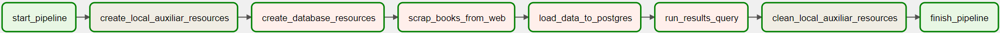
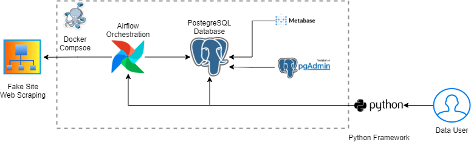

# Cayena Case

This README introduces how to set up the application locally, build and deploy all the Resources and Services.

In order to solve the proposed challenge, it was chosen to use Apache Airflow together with Python to create a pipeline capable of extracting the data from the Fake Web Site, performing the necessary transformations and, finally, loading the data into a production-ready database. PostgreSQL was the SQL engine choose to store the final data to be consumed and the BI Tool Metabase was also disponibilazed for the user interaction.

To build the infrastructure, docker images were used together with docker-composer, where in addition to Airflow, PostgreSQL and Metabase, pgAdmin4 is also being made available to facilitate interaction with the Database.

Everything about the infra can be found in the project's root folder, inside the `docker-compose.yml` file. In addition to this, the other important files for this stage of the challenge are contained in the DAGs folder (`{project_root}/airflow/dags`) and they are:

* `etl_script.py` Script containing the creation of the DAG responsible for executing the ETL pipeline as well as generating all its tasks.

* `config.py` Configuration file containing all the information needed to perform control and processing throughout the application.

* `web_scraping.py` Class responsible for performing all the processing necessary for the application. As the DAG Tasks are executed, different methods within the class will be requested so that the data is extracted, transformed and loaded correctly.

* `questions.sql` Query responsible for returning the results requested as example.

### Running Resources

##### Docker Compose

To deploy locally all the infra resources for this application, we can start the docker-compose.yaml with:

    docker-compose up -d

After few minutes, all the resources will be up. To finish them, we use docker-compose again:

    docker-compose down --remove-orphans
    docker volume prune #if wou want to clean docker local volumes

##### Services

As said before, some OpenSource tools are being used in the whole process, and their access can be done trougth the correct endpoint:

* `Airflow` Accessible at `http://localhost:8080/`, with the user and pass `airflow/airflow`. To run the pipeline DAG, just click at Execute on the `etl_pipeline` DAG or trigger the button at the left of the name. Then you can click on DAG > Graph to visualise the current status.
* `PostegreSQL` Expose on port -> `5342`, host -> `localhost` for local connection and -> `postgresql-cayena` if using pgAdmin inside docker, admin -> `cayena`, password -> `cayena`, database -> `cayena`.
* `pgAdmin4` Accessible at `http://localhost:5050/`, with the user `admin@admin.com` and pass `root`. After logged you can register a connection with the Server to check the results.
* `Metabse` Accessible at `http://localhost:3000/`. After you first login will be necessary to setup the Tool with you information and connect to the `PostegreSQL` database with the informations provided before.

## HOW TO

To execute the Application, first is necessary to set up the docker-compose resources locally and ensure that all of them are already working properly. After this step, you can access the Airflow Web Service at you localhost and execute the `etl_pipeline` DAG at the DAG tab.

After the process finish, you can access the PostgreSQL database using pgAdmin4 or the Metabase Tool or other way and check that inside the `cayena` database we have a schema called `analytics` with 2 table, one of them containing all teh information about the books and another with the results for the examples questions.

The Web Scraping script was build with python and the library BeatifulSoap
You can check bellow the DAG's Tasks.



### Infrastructure

As we can see on the diagram bellow, our infrastructure is managed with `docker-compose` wich simplifies the task to handle the deploy of all services. Our solution uses the Airflow to orchestrated all the necessary piplines, at this moment, we have only one DAG which handles all the task to Extract the data from web, perform the necessaries transformations and load it on the PostgreSQL Database, where we can directly consume the data. If we want to have a more interact experience, is also avaliable a Metabase Tool where is possible to build Dashbords to answare the business questions.




## Workshop

I'm providing an Jupyter Notebook file called Workshop, where have more explanations about how to interact with the plataform using a simple Example Class, which could be upgraded for a framework capable to execute any kind of serice.


### IMPROVMENTS

Unfornutatly, I didn't manage to invest on this solution more than 7 hours, so those are the next steps that I have in my mind:

* Make the services more decentralized.
* Create an Api as a Serving Layer to provide access to the methodes showed at workshop.
* Create a CLI for user interaction.
* Create more methodes to help the user interact with the platform and the data.
* Improve the Service itself to run in parallel and improve the performance.
* Create a Data Lake to store the data.
* Create a Datawarehouse formore performatic data consuption.
* Use airflow to orchestrate the more complex tasks from user, like create a a big source of data or schedule a dataset to be automatically provided.

When we talk about a data platform, is always good to have in mind thad all services need to be User friendly and also scalable, this is why each parth of the platform is build as a unique service, for better maintence and evolution of the solution.

## Quick Setup

First, you need to have already installed on your machine:
```
python3
docker
docker-compose
```

Clone this repository:

```
$ mkdir Repos
$ cd Repos 
$ git clone https://github.com/raafaadg/cayena-case
```
Then create a virtual python environment
```
$ python -m venv .venv
```

Activate it
```
$ .venv\Scripts\activate.bat or source.bat
```

Install the required dependencies

```
$ pip install -r requirements.txt
```

To locally run Airflow with docker-compose

```
Run on terminal

$ docker-compose up -d

Got to:
http://localhost:8080/home
admin:airflow
user:airflow
```

To stop Airflow

```
$ docker-compose down
```